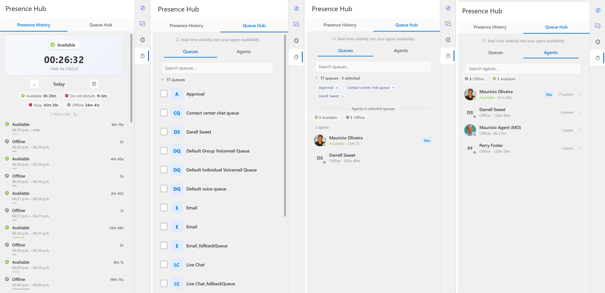
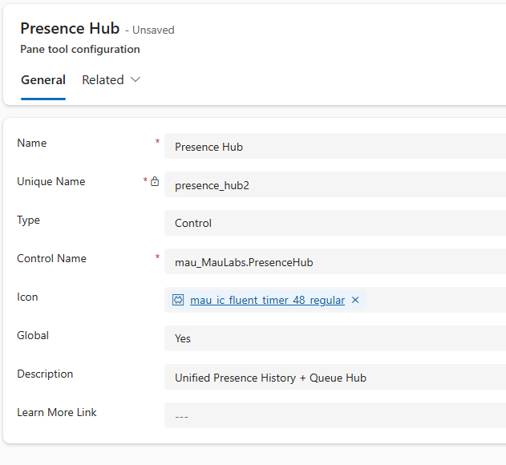

# Presence Hub

**Know how long you've been on break. See who else is around before you log off.**

Presence Hub is a small panel that lives inside the **Dynamics 365 Customer Service workspace** (the app your agents use every day). It shows your own availability status — and the status of everyone in your queues — in one place, so your team can keep an eye on coverage without picking up the phone or pinging Teams.



---

## Table of Contents

- [What your agents will see](#what-your-agents-will-see)
- [Status colors at a glance](#status-colors-at-a-glance)
- [Before you start](#before-you-start)
- [Step 1 — Install Presence Hub in your environment](#step-1--install-presence-hub-in-your-environment)
- [Step 2 — Add Presence Hub to the productivity pane](#step-2--add-presence-hub-to-the-productivity-pane)
- [Step 3 — Turn it on for your agents](#step-3--turn-it-on-for-your-agents)
- [Frequently asked questions](#frequently-asked-questions)
- [For developers](#for-developers)
- [License](#license)

---

## What your agents will see

Presence Hub is a side panel with **two tabs**.

### 1. Presence History — *"How long have I been on lunch?"*

- A big, color-coded card showing the agent's **current status** (Available, Busy, Away, etc.)
- A **live timer** counting how long they've been in that status — even if they refresh the page or close the browser, the timer keeps the right time
- A **timeline of their day** showing every status change
- **Summary chips** that add it all up: "1h 45m Available · 30m Lunch · 15m Break"
- A **calendar** so they (or their supervisor) can look back at any past day
- Always shown in the agent's own local time
- Refreshes itself every few seconds

### 2. Queue Hub — *"Is anyone else around to take this?"*

- A list of every **queue the agent belongs to**
- A **search box** to find a queue quickly
- Click a queue to see **everyone assigned to it**, with:
  - Their photo (or initials) and a colored dot for their status
  - What status they're in right now
  - How long they've been in that status
  - A "**You**" badge on the agent's own row
- **Summary chips** showing how many people are Available / Busy / Away in that queue
- Available agents sort to the top, Offline agents to the bottom
- Refreshes itself every few seconds

---

## Status colors at a glance

Each status shows as a small colored dot — the same colors Omnichannel already uses in the top-right presence menu:

| Status | Color |
|---|---|
| Available | Green |
| Busy | Red |
| Do Not Disturb | Red |
| Away / Appear Away | Yellow |
| After Conversation Work | Pink |
| Offline / Inactive | Gray |

---

## Before you start

You'll need:

- **Dynamics 365 Customer Service** with **Omnichannel for Customer Service** enabled
- A **Customer Service workspace** app with the **productivity pane** turned on
- Permission to import solutions and edit the productivity pane (a **System Administrator** or **System Customizer** role is fine)
- Agents who are **signed in to Omnichannel** and **members of at least one queue** — otherwise there's nothing to show

You do **not** need to write any code or talk to your developers. The whole install takes about 10 minutes.

---

## Step 1 — Install Presence Hub in your environment

1. Go to the [Releases page](../../releases) and download the latest **solution zip file**.
2. Open [make.powerapps.com](https://make.powerapps.com) and choose the environment you want to install into (top-right corner).
3. In the left menu click **Solutions**, then **Import solution** at the top.
4. Upload the zip file and click through the wizard. When it finishes, click **Publish all customizations**.

That's it — Presence Hub is now in your environment. It's not visible to anyone yet; the next two steps switch it on.

---

## Step 2 — Add Presence Hub to the productivity pane

The productivity pane is the strip of small icons on the right side of the agent's screen (alongside Smart Assist, Knowledge, etc.). You need to tell it to show Presence Hub there.

1. Open the **Admin Center**.
2. Click on **Productivity**.
3. Then **Productivity tools**.
4. Click **+ New** and fill it in:

   

5. Click **Save**.

A new icon now appears in the right-hand pane of the Customer Service workspace.

---

## Step 3 — Turn it on for your agents

In Dynamics 365, what an agent sees in the productivity pane is controlled by their **Agent experience profile**. To give Presence Hub to specific agents:

1. **Customer Service admin center** → **Workspaces** → **Experience profiles**.
2. Open the profile that you want Presence Hub to be part of.
3. In **productivity pane**, make sure to enable **Presence Hub**.
4. Then **Save**.

They'll see the new icon the next time they refresh their browser.

> **No restart needed.** Agents just refresh their browser to see the change.

---

## Frequently asked questions

**My agent doesn't see the icon.**
Make sure their Agent experience profile includes Presence Hub (see Step 3), then ask them to refresh the browser.

**The Presence History tab shows "No status".**
The agent needs to be signed in to Omnichannel and have a presence set. Once they're online, the panel updates within a few seconds.

**The Queue Hub tab is empty.**
The agent isn't a member of any queue yet. Add them to a queue in the Customer Service admin center, and the list will populate on refresh.

**Does the timer keep counting if the agent refreshes or closes the browser?**
Yes. The time shown is based on when they actually changed status — not when the panel loaded — so it's always accurate.

**Can a supervisor see other agents' history?**
The Presence History tab shows the **signed-in agent's** own history. To check a teammate's history, use the Queue Hub tab to see their current status, or use the standard Omnichannel reports in Dynamics.

**Is any data sent outside my Dynamics environment?**
No. Presence Hub only reads data that already exists in your Dataverse (Dynamics 365) environment. Nothing is sent to a third-party service.

---

## For developers

Want to modify Presence Hub or build it yourself? See the technical details below.

### Build from source

```bash
git clone https://github.com/moliveirapinto/Presence-Hub.git
cd Presence-Hub
npm install
npm run build
```

### Project structure

```
Presence-Hub/
├── PresenceHub/
│   ├── ControlManifest.Input.xml   # PCF manifest
│   ├── index.ts                    # Both tabs, all logic
│   └── css/PresenceHub.css         # Styles
├── package.json
├── tsconfig.json
├── pcfconfig.json
└── Presence-Hub.pcfproj
```

### Dataverse tables used

| Tab | Tables read | Purpose |
|---|---|---|
| Presence History | `systemuser`, `msdyn_agentstatus`, `msdyn_agentstatushistory`, `msdyn_presence` | Current status, persistent timer, daily timeline |
| Queue Hub | `queue`, `queuemembership`, `systemuser`, `msdyn_agentstatus`, `msdyn_presence` | Queue list, queue members, their live presence |

The control uses the **WebAPI** and **Utility** PCF features and is read-only — it never writes to Dataverse.

### Related projects

Presence Hub combines two earlier standalone controls into a single two-tab experience:

- [Presence Timer](https://github.com/moliveirapinto/modern-sla-timer-pcf)
- [Queue Hub](https://github.com/moliveirapinto/Queue-Hub)

---

## License

[MIT](LICENSE) — free to use, modify, and share.
